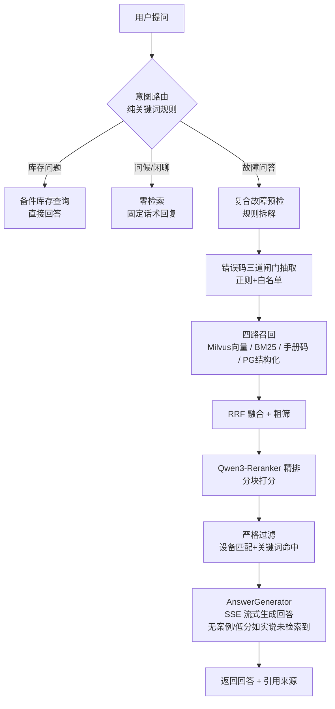
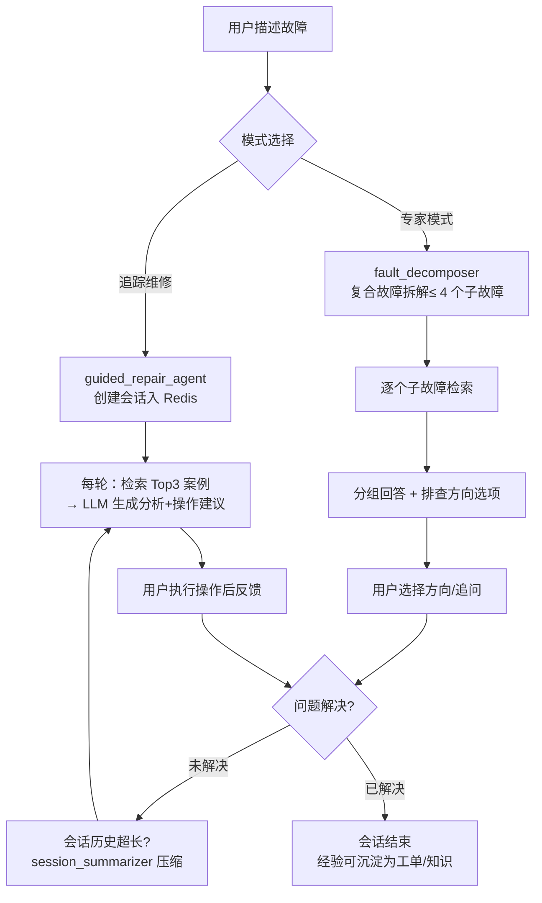
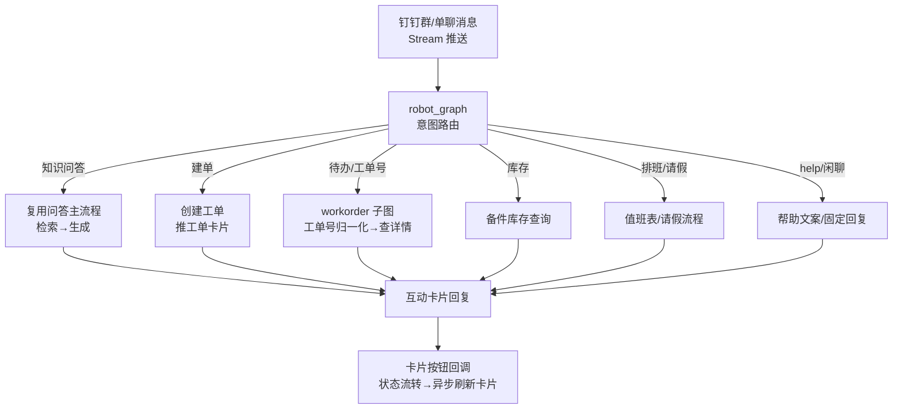

# Smart-Repair-System · 智能维修系统

面向制造企业的**设备维修数字化平台**，核心目标是把老师傅的维修经验沉淀为结构化工单和知识库，让维修人员通过自然语言提问即可检索历史案例、设备手册错误码和诊断建议。

```
维修工单/历史工单 ──→ 知识抽取、去重、人工审核 ──→ 知识库
                                      │
新人提问 ──→ 意图路由 ──→ 混合检索（向量 + BM25 + 手册错误码）
                                      │
                          RRF 融合 → 过滤 → Reranker 精排 → AI 诊断回答
```

## 一、核心能力

| 能力 | 说明 |
| --- | --- |
| 工单全生命周期 | 14 态状态机，从 DRAFT 到 ARCHIVED/REJECTED，每次流转写入进度日志 |
| 设备台账与监控 | 设备档案、运行状态、心跳、故障标签、外部监控系统同步接口 |
| 知识库 RAG | PostgreSQL BM25 + Milvus 向量双路召回，RRF 名次融合，两级模型精排 |
| 设备手册错误码库 | 说明书错误码结构化入库，精确匹配 + 语义双路检索，权威方案置顶 |
| AI 智能问答 | LangGraph 主图意图路由（库存 > 聊天 > 故障），SSE 流式回答 |
| 追踪维修 | LangGraph 多轮对话状态机，按“分析 + 操作”逐步引导排查 |
| 专家模式 | 复合故障拆解，并行 ReAct 检索，按故障分组流式回答 |
| 知识审核与去重 | DRAFT/UNDER_REVIEW/PUBLISHED/DEPRECATED/ARCHIVED 状态，LLM 去重检测 |
| 备件库存 | 备件台账、安全库存、库存预警、进货单批量导入 |
| 排班 / 请假 / 派工 | 班次排班、请假申请与审批、顶岗人、工单冲突预检、主管派工 |
| 数据驾驶舱 | 工单、设备、知识、备件等聚合统计看板 |
| 钉钉集成 | 扫码登录、OAuth、机器人对话、OA 审批、工单卡片、通讯录同步 |
| 历史工单导入 | PDF 上传，LangGraph 流水线抽取，人工确认后写入工单并收录知识 |
| MCP 服务 | 通过 `/mcp` 向外部 AI 客户端暴露知识检索、工单、库存、设备等工具 |

## 二、技术栈

| 层 | 技术 |
| --- | --- |
| 前端 | Vue 3、Vite、Pinia、Element Plus、Vue Router、Axios |
| 后端 | FastAPI、SQLAlchemy 2.0、Alembic、Pydantic v2、Loguru |
| AI / Agent | LangChain、LangGraph、FastMCP、DeepSeek、RAGFlow/LangFuse/local 追踪 |
| 召回 / 精排 | bge-m3 召回（1024 维）、Qwen3-Reranker-0.6B 精排 |
| 数据存储 | PostgreSQL 16、Redis 7、Milvus 2.4、MinIO、etcd |
| 集成 | 钉钉开放平台、阿里云短信、RAGFlow |
| 测试 | Pytest、pytest-asyncio、pytest-cov |

## 三、系统架构

```text
┌────────────────────────────────────────────┐
│ Vue 3 + Vite 前端（Port 4173）              │
│ 驾驶舱/工单/设备/知识/手册/库存/搜索/AI/排班 │
└────────────────────┬───────────────────────┘
                     │ HTTP / SSE
┌────────────────────▼───────────────────────┐
│ FastAPI 后端（Port 18080）                  │
│ API 层：21 个路由模块，另挂载 MCP             │
│ Agent 层：QA Graph、追踪维修、专家模式、      │
│ 工单导入、钉钉机器人、ReAct                  │
│ 公共检索编排层：retrieval_flow.py           │
└───┬────────┬────────┬────────┬────────────┘
    │        │        │        │ HTTP
┌───▼───┐ ┌──▼───┐ ┌──▼──┐ ┌──▼────────────┐   ┌─────────────────┐
│ PG 16 │ │Milvus│ │Redis│ │ 推理服务 8010  │   │ DeepSeek 云端   │
│15432  │ │19530 │ │7379 │ │ bge-m3 +       │   │ LLM 问答/抽取/  │
│业务+  │ │向量库 │ │会话 │ │ Qwen3-Reranker │   │ Agent 推理      │
│BM25   │ └──┬───┘ │缓存 │ │（纯 CPU，双模型）│   └─────────────────┘
└───────┘    │     └─────┘ └───────────────┘
        依赖 etcd（元数据）+ MinIO（对象存储）
```

### 3.1 后端分层

| 层 | 目录 | 职责 |
| --- | --- | --- |
| API 层 | `app/api/` | 21 个路由模块：鉴权、参数校验、同步/异步（长任务用 `asyncio.to_thread` 包同步检索）、SSE 流式下发 |
| Agent 层 | `app/agents/` | LangGraph 图（智能问答主图、追踪维修、专家模式）+ 单职责 Agent（去重、知识抽取、工单导入流水线） |
| 检索编排层 | `agents/retrieval_flow.py` + `agents/tools.py` | 四路召回、RRF 融合、粗筛/精排/过滤、错误码正则提取；**所有 AI 入口共用**，保证行为一致 |
| 能力层 | `app/core/` | 推理服务客户端（embeddings/reranker）、向量库、缓存、数据库、钉钉/短信/通知 |

### 3.2 双库分工

| | PostgreSQL | Milvus |
| --- | --- | --- |
| 定位 | 正本档案室：全部业务数据 + 结构化检索 | 语义储物柜：只存 1024 维向量副本 |
| 集合/表 | `knowledge_items`、`manual_code_entries`、工单/设备/备件等 | `knowledge`（知识案例）、`log_code`（手册错误码） |
| 承担检索路 | BM25 关键词路（ILIKE 加权）、手册精确路（错误码等值） | 知识向量路、手册语义路（COSINE ANN） |

### 3.3 两级模型（都托管在统一推理服务 8010）

| | bge-m3（召回） | Qwen3-Reranker-0.6B（精排） |
| --- | --- | --- |
| 类型 | bi-encoder，离线预计算文档向量 | cross-encoder，query×文档联合编码 |
| 输出 | 1024 维 dense 向量（已 L2 归一化） | 0~1 相关分 |
| 接口 | `POST /v1/embeddings`（OpenAI 兼容，RAGFlow 共用） | `POST /v1/rerank`（分块调用，防 CPU 内存峰值） |
| 部署 | 纯 CPU fp32，两模型单进程共约 5GB 内存 | 同左 |

### 3.4 一次智能问答的数据流

```text
提问 → 意图路由（库存>聊天>故障） → 错误码正则预检 → 最多四路召回
     → RRF 融合 → 粗筛+严格过滤 → Qwen3-Reranker 精排 → 置顶/情形重排
     → LLM 生成（无案例/低分时如实回答“未检索到”） → SSE 流式返回
```

### 3.5 关键设计决策

- **推理服务独立进程**：模型推理与业务解耦，可独立升级/扩缩容；主链路启动不加载模型，推理服务挂掉时检索自动降级而非整体不可用
- **LLM 只花在语义边界**：意图路由、错误码提取、关键词清洗均为确定性规则（零成本、零延迟）；LLM 只用于回答生成、可答性裁决等无法用规则表达的环节
- **全链路降级**：推理服务不可用 → BM25-only；Reranker 不可用 → 规则重排；严格过滤为空 → 回答层如实说未检索到；任何单点故障都不导致“无回答”
- **本地模型 + 云端 LLM 混合**：检索相关模型全部本地 CPU（数据不出内网），仅生成环节调 DeepSeek 云端

### 3.6 LangGraph 图编排

项目共有 **3 张 LangGraph 图**（主图+子图嵌套），另有追踪维修/专家模式是普通多轮状态机（不用图，见下）：

**① 智能问答主图（`qa_graph.py`）**——条件边意图路由 + 故障子图三节点流水线：

```text
router ──条件边──┬─→ chat 子图（问候/闲聊，零检索）          → END
（占位节点）      ├─→ inventory 子图（备件库存查询）        → END
                  └─→ fault 子图：
                      compound_check（复合故障预检，零 LLM）
                        → retrieve（四路召回+RRF）
                        → filter（粗筛+精排+严格过滤+置顶） → END
```

要点：路由用 `add_conditional_edges` 而非 LLM 分类；子图可独立 compile 复用。

**② 钉钉机器人图（`robot_graph.py`）**——同一套“占位 router + 条件边分发”模式，9 个意图分支：help / create（建单）/ todo（待办）/ inventory / duty（排班）/ repair（追踪维修）/ none / workorder 子图（工单号归一化 → 查详情）。

**③ 历史工单导入流水线（`work_order_importer.py`）**——带失败分支的 DAG：

```text
parse（PDF 解析）─失败→ save_error
      │成功
extract（LLM 抽取）─失败→ save_error
      │成功
validate（字段校验）→ save_draft（存草稿待人工确认）→ END
```

**哪些模块没有用图，以及为什么**（`agents/` 共 17 个模块，只有 3 个上图，其余按原因分四类）：

| 类别 | 模块 | 不上图的原因 |
| --- | --- | --- |
| 跨请求多轮会话 | 追踪维修 `guided_repair_agent`、专家模式 `expert_repair_agent` | 状态存 Redis，每次 HTTP 请求只推进一小段，**不存在一次性跑完的固定拓扑**；硬上图要自己接 checkpoint 持久化，与现有 Redis 会话重复建设，收益为零 |
| 单请求内循环 | ReAct 检索 `retrieval_agent`（最多 5 轮） | 循环是否继续取决于**运行时语义判断**（LLM 判“够不够”），本质是带退出条件的 while 循环；图只能描述静态拓扑，把动态循环塞进图反而多一层封装 |
| 单次 LLM 调用 | 回答 `answer_generator`、去重 `dedup_agent`、知识抽取 `knowledge_extractor`、手册结构化 `manual_structurizer`、故障拆解 `fault_decomposer`、工单理解 `ticket_agent`、会话摘要 `session_summarizer` | 单输入单输出、无分支无循环，**没有可编排的拓扑**；图的价值在节点间流转，单函数调用上图纯属样板 |
| 纯规则零 LLM | 错误码提取、查询清洗 `query_extractor`、意图路由（条件边实现） | 确定性规则 <30ms，作为图内**节点**被调用即可，本身不需要编排 |

一句话决策原则：**图解决的是“多个步骤按什么拓扑流转”的问题——没有多步拓扑（单次调用）、拓扑在运行时才确定（循环/多轮会话），就不该用图。**

### 3.7 Agent 盘点：5 个 Agent + 12 个工具模块

`agents/` 目录 17 个模块，按职责划分为两类：**5 个 Agent**（承担独立判断/自主决策任务）+ **12 个工具模块**（编排、生成、规则工具）。

**Agent 层（5 个）**：

| 模块 | 类型 | 职责 |
| --- | --- | --- |
| `retrieval_agent` | 自主循环 | ReAct 检索：LLM 每轮自主决定换词重搜/补充/停止，最多 5 轮 |
| `guided_repair_agent` | 多轮对话引擎 | 追踪维修：“分析+操作”逐步引导，Redis 会话持久化 |
| `expert_repair_agent` | 多轮对话引擎 | 专家模式：复合故障拆解 + 排查方向多轮引导 |
| `dedup_agent` | 独立判断 | 新知识入库前查重：与已有条目语义比对并给出合并/独立入库裁决 |
| `ticket_agent` | 独立判断 | 工单 AI 理解：故障分析、方案建议、结构化抽取 |

**工具模块（12 个）**：

| 分组 | 模块 | 职责 |
| --- | --- | --- |
| 图编排（3） | `qa_graph`、`robot_graph`、`work_order_importer` | 拓扑写死的 LangGraph 工作流，负责流转不负责决策 |
| 功能工具（5） | `answer_generator`（把检索案例渲染成回答，智能在上游检索）、`knowledge_extractor`、`fault_decomposer`、`manual_structurizer`、`session_summarizer` | 单次 LLM 调用完成固定转换任务，无循环无自主性 |
| 检索工具（4） | `tools.py`、`retrieval_flow`、`query_extractor`、`inventory_tools` | 四路召回/RRF/精排编排、错误码正则、查询清洗，纯代码+规则 |

分工原则：**能用规则不用 LLM，能用单次调用不上循环，能固定拓扑不引入自主决策**——自主性每多一分，延迟、成本和不可控性就多一分，只在检索策略无法预定义（ReAct）以及需要多轮引导/独立判断的业务点给了 Agent 地位。

### 3.8 核心业务流程图

三条主要业务流程的 mermaid 流程图（GitHub / IDE 预览可直接渲染）。

**① 智能问答主流程**（`/answer/stream`，系统主动脉）：



**② 维修引导流程**（多轮对话，Redis 会话持久化，用户驱动每一步）：



**③ 钉钉机器人流程**（Stream 长连接，robot_graph 9 意图分发）：



三条流程共用同一条检索主干道（retrieve → filter），只在入口和出口上分叉——这是把 `retrieval_flow` 抽成公共编排层的原因。

核心服务：

| 服务 | 本机端口 | 说明 |
| --- | --- | --- |
| PostgreSQL | 15432 | 业务数据、BM25 检索 |
| Redis | 7379 | 会话、缓存、追踪维修会话 |
| etcd | 2379 | Milvus 元数据 |
| MinIO | 9000 / 9001 | Milvus 依赖的对象存储 |
| Milvus | 19530 / 9091 | 知识向量、手册错误码向量 |
| Attu | 8080 | Milvus Web 管理界面 |
| 统一推理服务 | 8010 | bge-m3 编码 + Qwen3-Reranker 精排 |
| 后端 API | 18080 | FastAPI，Swagger 在 `/docs` |
| 前端开发服务器 | 4173 | Vite，代理 `/api` 和 `/dingtalk` 到 18080 |

> `docker-compose.yml` 是 RAGFlow 编排，核心开发基础设施使用 `docker-compose.dev.yml`（全部容器已配 `restart: unless-stopped`，Docker Desktop 重启后自动恢复）。根目录 `.env` 用于 Docker 和 RAGFlow 插值，后端业务配置在 `backend/.env`。

## 四、目录结构

```text
Smart-Repair-System/
├── backend/
│   ├── app/
│   │   ├── agents/            # QA 图、追踪维修、专家模式、检索、工单导入等
│   │   ├── api/               # FastAPI 路由模块
│   │   ├── core/              # 配置、数据库、缓存、向量、推理服务、钉钉、短信、通知
│   │   ├── mcp/               # MCP Server 与业务工具
│   │   └── models/            # SQLAlchemy 模型
│   ├── alembic/versions/      # 数据库迁移
│   ├── scripts/               # 种子数据、向量同步、手册导入、阈值校准
│   ├── tests/                 # 单元测试
│   ├── .env / .env.example
│   └── Dockerfile
├── frontend/
│   ├── src/api/               # 前后端接口封装
│   ├── src/layouts/           # PC 端与移动端布局
│   ├── src/router/            # 路由
│   ├── src/styles/            # 全局样式
│   └── src/views/             # 页面
├── docker-compose.dev.yml     # 开发基础设施：PG/Redis/Milvus/etcd/MinIO/Attu
├── docker-compose.yml         # RAGFlow 编排（可选）
├── requirements.txt           # Python 依赖
├── setup.ps1                  # 一键初始化
├── start_all.ps1              # 一键启动
├── start_embedding_server.ps1 # 单独启动推理服务
└── 项目说明/                  # 操作指南、检索链路、面试学习指南
```

### 后端核心目录

- `app/agents`：`qa_graph.py`、`guided_repair_agent.py`、`expert_repair_agent.py`、`retrieval_flow.py`、`retrieval_agent.py`、`fault_decomposer.py`、`answer_generator.py`、`manual_structurizer.py`、`knowledge_extractor.py`、`dedup_agent.py`、`ticket_agent.py`、`robot_graph.py`、`work_order_importer.py`、`session_summarizer.py`、`inventory_tools.py`、`tools.py`（命名约定：只有承担独立判断/自主决策职责的模块才带 `_agent` 后缀）
- `app/api`：认证、用户、设备、工单、工单导入、知识、手册错误码、备件、分类、故障码、搜索、会话、驾驶舱、排班、请假、通知、派工、钉钉、文件上传、级联数据
- `app/core`：`embedding_server.py`、`embeddings.py`、`reranker.py`、`vector_store.py`、`cache_service.py`、`database.py`、`config.py`、`security.py`、`dingtalk*.py`、`robot_handler.py`、`notification.py`、`sms.py`、`stock_alert.py`、`sys_config.py`、`manual_text.py`、`langfuse_tracer.py`
- `app/models`：用户、设备、工单、进度日志、知识、手册错误码、故障码映射、分类、备件、排班、请假、通知、系统配置、工单导入批次与明细

### 前端主要页面

- PC 端：数据驾驶舱、维修报表、工单新建/详情、设备列表/表单、知识库/知识表单、设备手册、故障码、库存、仓库、搜索、AI 问答、用户、分类、导入、个人设置、账号安全、帮助、主管派工、实时进度、排班管理
- 移动端 `/m`：故障上报、我的工单、工单详情

## 五、初始化与启动

### 前置条件

- Docker Desktop
- Python 3.10+
- Node.js 18+
- `backend/.env` 配置 `DEEPSEEK_API_KEY`

### 一键初始化

```powershell
.\setup.ps1
```

脚本会完成：Docker 基础设施启动、后端虚拟环境与依赖安装、`backend/.env` 检查、Alembic 迁移、种子数据导入、知识向量同步、前端 `npm install`。也可以按需跳过：

```powershell
.\setup.ps1 -SkipInfra
.\setup.ps1 -SkipBackend
.\setup.ps1 -SkipFrontend
.\setup.ps1 -SkipDB
```

### 一键启动

```powershell
.\start_all.ps1
```

该脚本会检查 Hyper-V/WSL 保留端口冲突，启动开发基础设施、统一推理服务、后端和前端，并轮询推理服务 `/health` 就绪。

### 手动启动

```powershell
# 1. 启动基础设施
docker compose -f docker-compose.dev.yml up -d

# 2. 启动推理服务（bge-m3 + Qwen3-Reranker，CPU 加载约 3-6 分钟）
cd backend
python -m app.core.embedding_server --host 0.0.0.0 --port 8010

# 3. 初始化数据库（首次）
alembic upgrade head
python scripts\seed_knowledge.py
python scripts\seed_categories.py
python scripts\seed_fault_codes.py
python scripts\seed_data.py
python scripts\import_manual_codes.py   # 可选：导入设备手册错误码
python scripts\sync_vectors.py          # 知识条目同步到 Milvus

# 4. 启动后端
uvicorn app.main:app --host 0.0.0.0 --port 18080

# 5. 另开终端启动前端
cd ..\frontend
npm install
npm run dev
```

访问地址：

- 前端：<http://127.0.0.1:4173>
- 后端 Swagger：<http://127.0.0.1:18080/docs>
- 健康检查：<http://127.0.0.1:18080/health>
- 推理服务健康检查：<http://127.0.0.1:8010/health>

## 六、AI 问答与检索链路

### 检索策略

1. 错误码预检：正则从提问/日志原文提取报警码（混合码自由匹配 + 纯数字码白名单裁决，零 LLM），命中则激活手册双路
2. 召回：知识库向量 + BM25 双路（各 top 30）；含错误码时增加手册错误码精确 + 语义两路
3. 融合：RRF 名次融合（k=60），复合去重键防止双库撞号
4. 过滤：向量相似度粗筛（0.15）+ 设备类型 / 故障关键词严格过滤
5. 精排：Qwen3-Reranker-0.6B 对头部 30 条候选打分（分块批调用防内存峰值）；不可用时回退规则重排
6. 置顶与重排：手册错误码精确命中置顶，情形条件匹配加分
7. 回答护栏：无案例或最高分低于阈值时如实回答“未检索到相关案例”，prompt 约束不匹配时不得硬凑回答

详见[检索全链路详解](<项目说明/检索全链路详解.md>)。

### 降级策略

- 推理服务不可用：检索自动降级为 BM25-only，跳过向量分数阈值
- Reranker 不可用：回退 `weighted_rerank` 规则重排；连续失败进入 60s 冷却期避免雪崩
- 严格过滤为空：返回空结果（不做跨设备兜底，避免噪声伪装成结果），由回答层如实说未检索到

### AI 模式

| 模式 | 入口 | 说明 |
| --- | --- | --- |
| 智能问答 | `/api/v1/search/answer/stream` | LangGraph 意图路由：库存 > 聊天 > 故障 |
| 追踪维修 | `/api/v1/search/guided-repair/*` | 多轮逐步排查，Redis 会话持久化 |
| 专家模式 | `/api/v1/search/answer/expert` | 复合故障拆解 + ReAct 检索 + 流式回答 |
| 专家模式下一步 | `/api/v1/search/answer/expert/step` | 多轮分析 + 引导 |
| 混合检索 | `/api/v1/search/hybrid` | 无 Agent 的检索链路 |
| Agent 检索 | `/api/v1/search/agent` | ReAct 循环检索 |
| 快速检索 | `/api/v1/search/quick` | 快速语义检索 |

## 七、设备手册错误码

手册错误码使用独立模型 `ManualCodeEntry`，与知识库职责分离：

- 知识库：历史维修工单沉淀的真实案例
- 手册库：设备说明书中的权威“错误码 → 故障诊断”映射

字段包括手册名称、设备类型、错误码、标题、描述、屏幕/日志原文、报警等级、影响、结构化条件、伴随报警、章节与页码。手册条目支持 JSON 批量导入、LLM 结构化解析、PG + Milvus 同步维护。

相关接口：

- `GET /api/v1/manual-codes`
- `POST /api/v1/manual-codes/parse`
- `POST /api/v1/manual-codes/import-json`
- `POST /api/v1/manual-codes`
- `PUT /api/v1/manual-codes/{id}`
- `DELETE /api/v1/manual-codes/{id}`

## 八、后端 API 模块

| Prefix / 路径 | 模块 | 主要能力 |
| --- | --- | --- |
| `/api/v1/auth` | 认证 | 密码登录、手机验证码、注册、钉钉扫码绑定 |
| `/api/v1/users` | 用户 | 用户 CRUD、当前用户、钉钉解绑 |
| `/api/v1/devices` | 设备 | 设备 CRUD、监控统计、外部状态同步 |
| `/api/v1/work-orders` | 工单 | 工单 CRUD、AI 分析、状态流转、归档、进度日志 |
| `/api/v1/work-order-imports` | 导入 | PDF 上传、抽取批次、人工确认入库 |
| `/api/v1/knowledge` | 知识 | 知识 CRUD、提取、去重、审核 |
| `/api/v1/manual-codes` | 手册 | 错误码 CRUD、解析、JSON 导入 |
| `/api/v1/spare-parts` | 备件 | 备件 CRUD、库存预警、进货导入 |
| `/api/v1/categories` | 分类 | 分类树管理 |
| `/api/v1/fault-codes` | 故障码 | 故障码映射列表与创建 |
| `/api/v1/categories/data/fault-phenomena` | 级联 | 故障现象选项 |
| `/api/v1/categories/data/root-causes` | 级联 | 根本原因选项 |
| `/api/v1/search` | 搜索 | 快速/混合/Agent/问答/追踪维修 |
| `/api/v1/session` | 会话 | 会话摘要压缩 |
| `/api/v1/dashboard` | 驾驶舱 | 聚合统计 |
| `/api/v1/duty-schedules` | 排班 | 排班、复制上周、请假批量登记 |
| `/api/v1/leave-requests` | 请假 | 请假申请、审批、冲突预检 |
| `/api/v1/notifications` | 通知 | 未读数、已读、全部已读 |
| `/api/v1/dispatch` | 派工 | 维修员列表、派工确认 |
| `/api/v1/dingtalk` | 钉钉 | 登录、通讯录、机器人、OA、卡片、移动端工单 |
| `/api/v1/upload` | 上传 | 工单图片/视频上传 |
| `/mcp` | MCP | Streamable HTTP MCP 服务 |

## 九、MCP 工具

MCP 服务通过 `app/mcp/server.py` 挂载到 `/mcp`，与钉钉机器人共用 `app/mcp/tools.py` 的业务实现：

- `search_knowledge`：故障描述检索历史案例并生成分析回答
- `guided_repair_chat`：按钉钉用户维护多轮追踪维修会话
- `query_work_order`：按工单号查询工单详情
- `query_my_workorders`：查询指定用户待处理工单
- `query_inventory`：自然语言库存查询
- `get_user_by_staff`：按钉钉 userId 查询绑定用户
- `get_device_list`：设备列表查询
- `get_knowledge_stats`：知识库统计
- `get_workorder_stats`：工单统计

MCP 访问控制：配置 `MCP_API_KEY` 后要求 `Authorization: Bearer <key>`；未配置时仅允许本机访问。

## 十、主要数据模型

| 模型 | 表 | 用途 |
| --- | --- | --- |
| User | users | 用户、角色、技能、钉钉绑定、负载 |
| Device | devices | 设备台账、运行状态、故障标签、外部系统同步 |
| WorkOrder | work_orders | 工单主数据、故障、处理方案、AI 分析、派工 |
| WorkOrderProgressLog | work_order_progress_logs | 工单状态流转留痕 |
| KnowledgeItem | knowledge_items | 知识库条目、状态、版本、提取元数据 |
| ManualCodeEntry | manual_code_entries | 设备手册错误码权威映射 |
| FaultCodeMapping | fault_code_mappings | 故障码映射 |
| Category | categories | 故障/现象/原因等分类树 |
| SparePart | spare_parts | 备件库存 |
| DutySchedule | duty_schedules | 排班与请假排班 |
| LeaveRequest / Detail | leave_requests / leave_requests_details | 请假申请与按天明细 |
| Notification | notifications | 站内通知 |
| SysConfig | sys_configs | 系统配置 |
| WorkOrderImportBatch / Item | work_order_import_batches / items | 历史工单导入批次与待确认条目 |

## 十一、配置说明

主要配置文件：

- `backend/.env`：后端业务配置，默认模板为 `backend/.env.example`
- 根目录 `.env`：Docker Compose 与 RAGFlow 插值变量

需要关注的关键配置：

| 配置项 | 说明 |
| --- | --- |
| `DEEPSEEK_API_KEY` | AI 问答、知识抽取、Agent 的必填密钥 |
| `EMBEDDING_SERVER_URL` | 推理服务地址，默认 `http://localhost:8010` |
| `EMBEDDING_MODEL_NAME` | 召回模型，默认 bge-m3 |
| `RERANKER_MODEL_NAME` | 精排模型，默认 Qwen3-Reranker-0.6B |
| `RERANKER_ENABLED` | 模型精排总开关 |
| `RECALL_TOP_K` / `FINAL_TOP_N` | 召回候选数（30）/ 最终送 LLM 条数（10） |
| `RETRIEVAL_COARSE_THRESHOLD` | 粗筛向量相似度下限，默认 0.15 |
| `RERANKER_CANDIDATES` | 送入精排模型的候选条数，默认 30 |
| `TRACING_BACKEND` | `ragflow` / `langfuse` / `local` |
| `DINGTALK_*` | 钉钉登录、机器人、OA 审批配置 |
| `SMS_*` | 阿里云短信配置，`SMS_ENABLED=false` 时不发送真实短信 |
| `MCP_API_KEY` | MCP 认证密钥 |

> Redis 端口提醒：`backend/.env` 当前使用 `7379`，但 `docker-compose.dev.yml` 默认插值 `REDIS_PORT=6379`。如果根目录 `.env` 或重建容器后映射端口变化，需要同步修改 `backend/.env` 的 `REDIS_PORT`。
