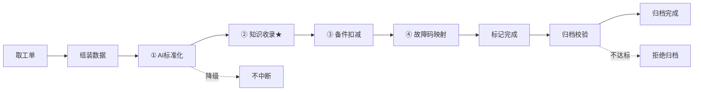
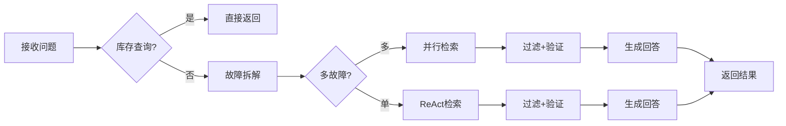

# Smart-Repair-System 两人任务分工方案

> 按业务主线内聚划分：维修执行域（甲方）+ 智能诊断域（乙方）。高内聚低耦合，可并行开发，仅一个硬交接点（工单表 + 知识抽取钩子）。

**标签**：甲方·维修执行域 ｜ 乙方·智能诊断域 ｜ 5 周开发周期 ｜ 钉钉整体归甲方

---

## 一、划分原则

把关联性强的模块聚成一个域，两人各负责一条业务主线，尽量减少跨人联调。

| 角色 | 主线 | 特点 |
|---|---|---|
| **甲方 · 维修执行域** | 工单全生命周期 + 设备 + 派工 + 钉钉 | 从报修→派工→维修→归档的业务链，偏 Web 业务开发，CRUD 与状态机为主。同时负责钉钉全套。 |
| **乙方 · 智能诊断域** | RAG 检索 + 双库 + Agent + 知识沉淀 | 检索→双库→Agent→知识抽取的智能链，偏 RAG/LangGraph，技术难度高但模块数较少。 |

> **唯一硬交接点**：工单表结构（甲方建表，乙方读）+ `_auto_publish_knowledge`（乙方实现，甲方工单完成时调用）。只要开工前定死这两处，两人即可完全并行。

---

## 二、甲方 · 维修执行域

负责工单/设备/派工/备件/移动端/钉钉/认证 全套业务流程。

### 2.1 后端 API 模块（12 个）

| 模块 | 职责 |
|---|---|
| `work_orders` | 工单 CRUD + 14 态状态机流转（`_do_transition`）+ 归档触发知识收录 |
| `devices` | 设备台账管理（设备类型/型号/厂商，监控字段预留） |
| `dispatch` | 智能派工（评分算法 + 自动分配 + 进度跟踪） |
| `duty_schedules` | 值班排班管理 |
| `leave_requests` | 请假申请（钉钉 OA 请假单同步 + 顶岗人预检/主管审批） |
| `notifications` | 通知服务（钉钉消息 + 站内通知） |
| `spare_parts` | 备件管理（出入库 + 库存预警） |
| `auth` | 登录/权限/JWT + 钉钉扫码会话（`_dingtalk_scan_sessions`） |
| `users` | 用户管理 / 角色权限（ADMIN/SUPERVISOR/TECHNICIAN/WORKER） |
| `upload` | 文件/图片上传（移动端拍照、故障媒体） |
| `session` | 会话管理 |
| `dingtalk` | 钉钉全套（见 2.3，8 个文件） |

### 2.2 Agents（3 个）

| Agent | 职责 |
|---|---|
| `ticket_agent` | 工单智能理解：AI 标准化故障描述、自动分类、字段校验 |
| `session_agent` | 会话状态管理 |
| `inventory_tools` | 库存查询工具（`query_inventory`，按设备类型/故障码关联备件） |

### 2.3 钉钉模块（8 个文件，整体归甲方）

钉钉本质是甲方业务在钉钉端的延伸，全部依赖甲方模块，不跨人开发。

| 文件 | 职责 |
|---|---|
| `api/dingtalk.py` | 主路由（~1500 行）：OAuth 登录/通讯录/移动端工单/请假机器人/派工卡片/OA 同步/定时任务 |
| `api/dingtalk_mock.py` | 钉钉仿真模式（无真实钉钉企业时本地调试） |
| `core/dingtalk.py` | 钉钉客户端核心（token/用户/部门/消息/卡片） |
| `core/dingtalk_card.py` | 通用卡片消息构建 |
| `core/dingtalk_wo_card.py` | 工单卡片（派工 accept/arrive/complete 按钮） |
| `core/dingtalk_oa_config.py` | OA 审批配置（processCode/AES/Token） |
| `core/dingtalk_oa_sync.py` | OA 审批单同步（请假单 → leave_request） |
| `core/dingtalk_stream.py` | Stream 事件流客户端（长连接接收事件） |

### 2.4 数据模型（9 个）

- `work_order` — 工单主表（14 态）
- `device` — 设备台账
- `user` — 用户/角色/钉钉字段
- `leave_request` — 请假申请 + 明细
- `duty_schedule` — 值班排班
- `spare_part` — 备件库存
- `notification` — 通知记录
- `progress_log` — 工单进度日志
- `sys_config` — 系统配置（灵活项）

### 2.5 前端页面

**PC 端（15 页）**

- `WorkOrders` / `WorkOrderForm` — 工单列表/表单
- `Devices` / `DeviceForm` — 设备台账
- `SupervisorDispatch` / `SupervisorProgress` / `SupervisorSchedule` — 主管派工/进度/排班
- `SpareParts` / `SparePartForm` / `Warehouse` — 备件/仓库
- `Users` / `Login` / `Profile` / `Security` / `Help` — 用户/登录/帮助

**移动端（3 页，/m）**

- `WorkerSubmit` — 工作人员报修上报
- `TechQueue` — 维修员工单队列
- `TechDetail` — 维修员工单详情/完成

### 2.6 关键技术点

- **14 态工单状态机**：主链路 DRAFT→SUBMITTED→ASSIGNED→ACCEPTED→ARRIVED→INSPECTING→IN_PROGRESS→ARCHIVING→ARCHIVED（`_do_transition` 校验合法流转）；SUBMITTED~IN_PROGRESS 各步可 REJECTED 拒绝且为终态（无挂起/重开）；COMPLETED 由完成接口（Web `/complete`、移动端 `/tech/complete`）直接标记；STANDARDIZED/CLASSIFIED/APPROVED 为旧版本兼容遗留态（无流转）
- **智能派工评分**：按技能匹配/负载/距离/值班状态打分排序
- **钉钉集成**：OAuth 扫码登录 + H5 免登 + Stream 事件流 + OA 审批同步 + 互动卡片回调
- **请假闭环**：机器人指令解析 → 审批卡片 → 顶岗人预检 → 主管审批 → 通知
- **移动端三页面**：报修/接单/维修，支持拍照/语音上报

---

## 三、乙方 · 智能诊断域

负责检索/知识库/手册库/Agent/知识沉淀 全套 AI 智能链路。

### 3.1 后端 API 模块（8 个）

| 模块 | 职责 |
|---|---|
| `search` | 检索与问答接口：`/quick` 语义速查 · `/hybrid`（知识库向量+BM25 两路 RRF）· `/agent`（ReAct 检索，遗留调试）· `/manual-lookup`（错误码录入预填：手册路[精确+语义] + 案例路[BM25+向量，RRF]，分路返回）· `/answer/stream`（智能问答 SSE）· `/answer/expert` + `/answer/expert/step`（专家问答 + 多轮引导）· `/guided-repair/start` / `{id}/step` / `chat`（追踪维修） |
| `knowledge` | 知识库管理（CRUD + Milvus 向量索引同步） |
| `manual_codes` | 手册错误码库（CRUD + 错误码→章节页码出处回溯） |
| `fault_codes` | 故障码管理 |
| `categories` | 故障分类（现象/根因级联体系） |
| `cascade_data` | 级联数据接口（供甲方表单调用） |
| `work_order_imports` | 历史工单导入（PDF/Excel 抽取 → 知识沉淀） |
| `dashboard` | 仪表盘数据聚合（灵活项） |

### 3.2 Agents（15 个）

| Agent | 职责 |
|---|---|
| `retrieval_agent` | ReAct 检索代理（LLM 决策选路/改写/重试；require_hybrid 首轮强制双路） |
| `retrieval_flow` | 公共检索编排层（错误码提取 → 双库召回 → RRF → 粗筛+模型精排 → 严格过滤 → 取 top N） |
| `tools` | Agent 工具集（手册查询/知识检索/库存等） |
| `answer_agent` | 智能问答（库存查询短路 + 快速诊断回答） |
| `expert_repair_agent` | 专家维修模式（单故障 ReAct / 多故障并行 ReAct + 多轮引导会话） |
| `guided_repair_agent` | 引导式维修（step 逐步引导 + chat 对话式） |
| `fault_decomposer` | 故障分解（多故障拆解为子问题，20s 超时） |
| `verify_agent` | 检索结果把关（Gate 存在性核对 + Judge 语义可答性 + 不足重搜） |
| `dedup_agent` | 知识条目入库去重（规则快路径 + 向量候选 + LLM 判定） |
| `query_extractor` | 查询提取/改写（白名单优先 + LLM 兜底，提取设备/故障） |
| `knowledge_extractor` | 知识抽取（工单解法 → 结构化知识） |
| `manual_structurizer` | 手册结构化（PDF 手册 → 错误码库） |
| `work_order_importer` | 工单导入器（批量历史工单入库） |
| `qa_graph` | QA 图编排（LangGraph：意图路由 chat/inventory/fault） |
| `robot_graph` | 机器人图编排（LangGraph：钉钉意图路由 help/create/todo/inventory/repair） |

### 3.3 数据模型（7 个）

- `knowledge` — 知识库（工单案例沉淀）
- `manual_code` — 手册错误码（含章节页码）
- `fault_code` — 故障码
- `category` — 故障分类
- `fault_phenomenon_category` — 故障现象分类
- `root_cause_category` — 根因分类
- `work_order_import` — 工单导入记录

### 3.4 前端页面（10 页）

- `AiAssistant` — AI 助手对话页（问答/追踪/专家/引导模式）
- `Search` — 检索页（粘贴日志/错误码 → 四路检索）
- `Knowledge` / `KnowledgeForm` / `KnowledgeLayout` — 知识库管理
- `ManualCodes` — 手册错误码库管理
- `FaultCodes` — 故障码管理
- `ImportWorkOrders` — 历史工单导入
- `Categories` — 故障分类管理
- `Dashboard` — 仪表盘（灵活项）

### 3.5 关键技术点

- **双库四路检索 + 两级精排**：手册路（错误码精确匹配 + 语义）+ 案例路（知识库 BM25 + 向量，RRF 融合）；无错误码时退化为案例两路。召回池经 粗筛(score≥阈值) → Qwen3-Reranker 模型精排（仅排序不过滤，推理服务不可用时降级规则加权重排）→ 严格过滤（设备精确匹配 + 故障词命中）→ 错误码置顶 → 取 top N
- **Milvus 向量库**：知识/手册双向量索引；召回编码用 bge-m3（1024 维，独立推理服务 8010 提供 HTTP 编码）
- **LangGraph 多 Agent**：qa_graph / robot_graph 编排问答与机器人流程，ReAct 推理
- **知识抽取流水线**：工单解法 → LLM 结构化 → 向量化入库（`_auto_publish_knowledge`）
- **手册结构化**：PDF 维修手册 → 错误码/现象/条件/章节页码结构化
- **工单导入**：PDF/Excel 历史工单批量解析 → 知识沉淀

---

## 四、双方核心工作流

基于项目源码梳理的两条核心工作流，以及串起双方的交接点。

### 4.1 甲方：工单完成流水线

**流程讲解**：工单完成后依次执行 AI 标准化 → 知识收录 → 备件扣减 → 故障码映射，然后标记完成；归档阶段校验关键字段完成度，达标才允许归档。

**策略选择**：

- **四步独立降级**：四步副处理各自独立 `try/except`，单步失败只记 warning 不中断——保证工单一定能完成，不因 AI 服务抖动卡死业务流程。
- **人工优先、AI 补位**：AI 标准化字段只在原字段为空时回填，不覆盖维修员人工录入，避免 AI 误判覆盖正确信息。
- **归档质量门槛**：6 关键字段（描述/现象/根因/方案/结果/工时）完成度校验，不达标拒绝归档，保证沉淀进知识库的工单质量。

**技术选型**：

- **状态机驱动**：14 态工单状态机，每步校验合法流转 + 角色权限，避免非法状态跳转和越权操作。
- **LLM 标准化**：用 DeepSeek 对非结构化故障描述做标准化（故障码/现象/根因/方案），降低维修员录入负担，同时为后续知识检索提供结构化数据。

### 4.2 乙方：专家诊断流水线

**流程讲解**：接收问题后先判断是否库存查询（短路返回）；否则 20s 内拆解故障——多故障时 `asyncio.gather` 并行推进，每个子故障各自跑完整 ReAct 检索循环（整体 90s 超时）；单故障跑单轮 ReAct（60s 超时，首轮强制双路召回）。结果经粗筛+精排过滤与 verify 把关后生成回答，返回诊断结论 + 参考案例 + 引导选项。

**技术选型**：

- **双库设计**：知识库（工单案例沉淀的经验）+ 手册库（设备厂商权威错误码）——经验与权威互补，既能查历史相似案例，又能查官方处理标准。
- **四路检索**：手册错误码精确匹配 + 手册向量 + 知识库向量 + 知识库 BM25——精确匹配保权威命中，向量检索保语义相似，BM25 保关键词命中，四路覆盖不同检索意图。
- **Milvus 向量库**：知识/手册双向量索引，支持高维近邻检索，适合语义相似度匹配。
- **LangGraph 编排**：多 Agent 流程编排，支持状态管理和循环推理，适合复杂诊断流程。

**模型选型**：

- **DeepSeek**：故障拆解、ReAct 推理、答案生成、验证——推理能力强且成本可控，适合企业私有化部署。
- **Embedding / 重排模型**：bge-m3 做召回向量化（1024 维，独立推理服务 8010 HTTP 编码）；Qwen3-Reranker-0.6B 做精排（cross-encoder 相关度重排）。

**策略选择**：

- **ReAct 循环**：LLM 自主决策调哪个工具、调几次，而非固定流水线——适应不同故障的检索需求，复杂问题多轮检索，简单问题快速命中。
- **多故障并行**：`asyncio.gather` 并行推进各子故障，每个子故障各自跑完整 ReAct 循环，提升复杂问题响应速度。
- **超时降级**：拆解 20s / 单故障 60s / 多故障 90s，超时不挂死，降级返回空结果而非卡死。
- **verify 把关**：存在性核对 + 语义可答性校验，防止 LLM 编造无依据答案。
- **RRF 融合**：倒数排名融合多路检索结果，避免单路检索偏差，综合排序更均衡。

### 4.3 闭环：两个交接点串起双方

- **① 维修中**：甲方工单详情页调乙方 `/search/*`，维修员实时获取 AI 诊断。
- **② 完成时**：甲方 `_auto_publish_knowledge` 把本次解法交给乙方收入知识库。

这形成了 **"维修执行 → 经验沉淀 → 下次检索召回"** 的数据飞轮——甲方不断产生新工单，乙方不断把解法沉淀进知识库，下次同类故障检索时命中更准。这正是系统"双库四路检索"价值持续放大的来源。

---

## 五、接口契约 / 交接点

两人协作的 5 个交接点，开工前先约定好，之后各自独立开发。

**① 工单表结构（最关键）**
甲方定义 `work_order` + `device` 模型字段，乙方只读（检索案例 / 知识抽取依赖）。开工第一周定死。
`app/models/work_order.py` · `app/models/device.py`

**② 知识抽取钩子 _auto_publish_knowledge**
乙方实现该函数：工单维修完成时把解法结构化并收录进知识库。甲方在工单完成流转、钉钉 `/tech/complete` 中调用。
`app/api/work_orders.py → _auto_publish_knowledge(wo, db)`

**③ AI 诊断嵌入工单页**
乙方提供 AiAssistant / Search 诊断组件与 `/search/*` 接口，甲方在工单详情页（PC + 移动端 TechDetail）嵌入调用。
`前端 AiAssistant.vue · 后端 /search/answer/expert · /search/manual-lookup`

**④ 故障分类接口**
乙方维护 `categories` + `cascade_data`（故障现象/根因级联），甲方工单表单调用获取分类选项。
`app/api/categories.py` · `app/api/cascade_data.py`

**⑤ 手册错误码查询**
乙方提供手册错误码库与查询接口，甲方移动端/工单页粘贴报警码时调用，返回诊断 + 手册章节出处。
`app/api/search.py → /search/manual-lookup`

---

## 六、开发顺序（5 周）

先公共基础 → 两条主线并行 → 联调交接点 → 收尾。

**第 0 周 · 公共基础（甲方先行）**
- **甲方** 搭 `core`（数据库/配置）+ `auth` + `users` + `upload`，定死工单表结构。
- **乙方** 搭 Milvus/Redis 环境、跑通 DeepSeek LLM 调用、验证 embedding 向量化。

**第 1–2 周 · 主线并行**
- **甲方** 工单 14 态状态机 + 设备台账 + 移动端 3 页。
- **乙方** 双库四路检索 + 知识库 + 手册错误码库 + 基础检索 Agent。

**第 3 周 · 主线扩展**
- **甲方** 智能派工 + 备件库存 + 钉钉全套（登录/移动端/请假/OA）。
- **乙方** AI Agent 全套（问答/专家/引导/拆解/校验）+ 工单导入流水线 + 知识抽取。

**第 4 周 · 联调交接点**
联调 5 个交接点：`_auto_publish_knowledge` 钩子 + AI 诊断嵌入工单页 + 故障分类接入 + 手册查询接入 + 移动端检索。

**第 5 周 · 收尾**
Dashboard 仪表盘、Categories 分类、钉钉机器人指令、整体测试与 bug 修复。**灵活项**（dashboard/categories/cascade_data/Help/sys_config）谁先完成谁接。

---

## 七、工作量评估

两条主线工作量大致均衡，特点互补。

| 角色 | 特点 | 说明 |
|---|---|---|
| **甲方 · 广而实** | 模块多、CRUD 多 | 12 API + 3 Agent + 8 钉钉文件 + 18 前端页。以成熟 Web 业务模式为主，状态机和钉钉集成是难点。 |
| **乙方 · 深而难** | Agent 多、技术难 | 8 API + 15 Agent + 10 前端页。模块数少，但双库四路检索 + LangGraph 多 Agent + 知识抽取/手册结构化流水线技术难度高。 |

> **技能建议**：擅长前端/业务/工程化的同学偏甲方；擅长 AI/算法/Python 的同学偏乙方。若两人技能相近，按本方案均分即可。

---

*Smart-Repair-System 两人任务分工方案 · 基于项目实际代码模块梳理 · 2026-08*
